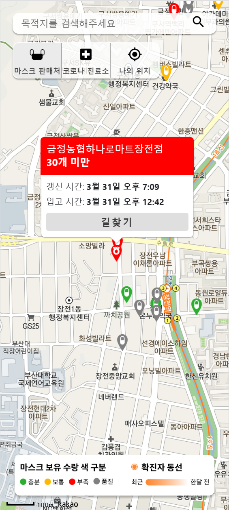
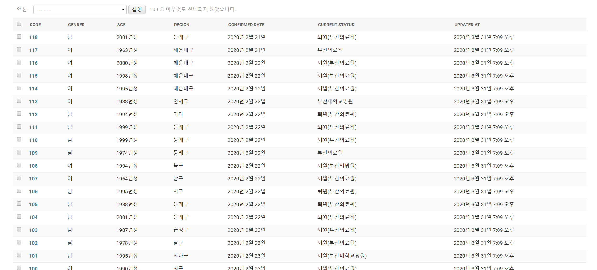

## 부산지역 코로나, 마스크 맵

## 결과물 🙌🏻

*<코로나-마스크 맵 Desktop>*

*<코로나-마스크 맵 mobile>*

*<코로나-마스크 맵 data>*

## Comment 👨🏻‍💻

- dp 세팅은 해두었지만 돈이 없어(서버비) deploy하지 않습니다 😿
- 본 프로젝트는 단순히 공부용입니다! 
- 기능은 공적마스크 데이터 활용 마스크 재고 및 판매처 찍기 및 확진자 동선 찍기 .. etc
- unist 코로나맵의 소스코드를 참조하였습니다.